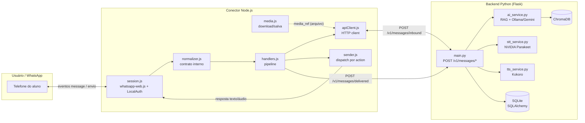
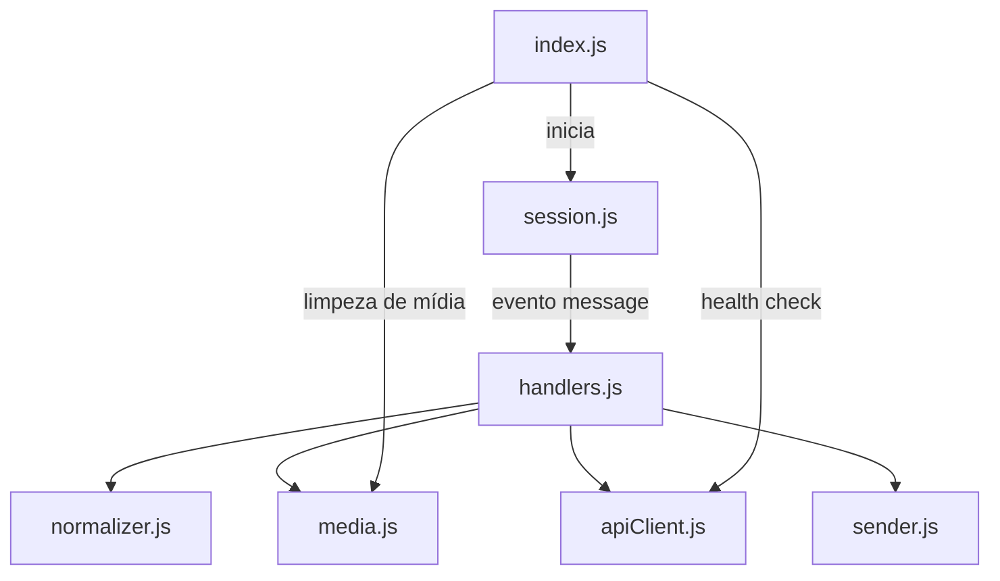
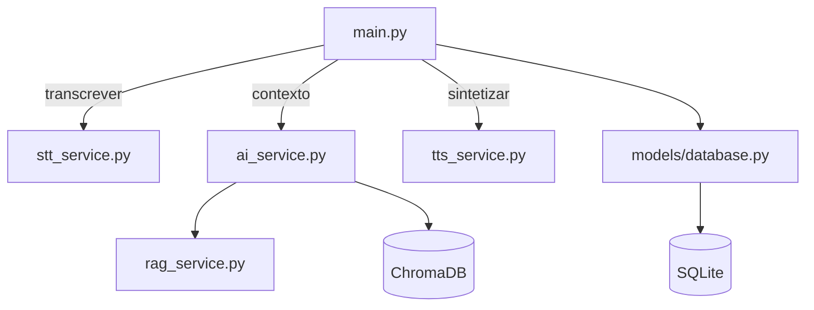
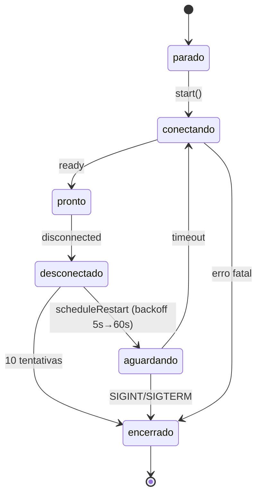

# 02 — Arquitetura

## Princípio central: dois serviços independentes

O projeto separa o **transporte** do **processamento** em dois serviços que se
comunicam por um contrato HTTP versionado:

- **Conector Node** (`apps/whatsapp-connector`): única ponte com o WhatsApp. Mantém a
  sessão (QR login via whatsapp-web.js), recebe mensagens, normaliza, envia respostas
  e confirma entrega. **Não conhece regras pedagógicas.**
- **Backend Python** (`src/curumim`): processa mensagens normalizadas, gerencia o
  perfil/onboarding do aluno, roda RAG + IA, transcreve áudio (STT), gera áudio (TTS)
  e registra rastreio. **Não fala diretamente com a Meta.**

## Fronteiras de responsabilidade

| Responsabilidade | Node | Python |
|---|---|---|
| Sessão WhatsApp, QR login, reconexão | ✅ | ❌ |
| Normalização para o contrato interno | ✅ | ❌ |
| Envio de respostas (texto/áudio) | ✅ | ❌ |
| Ack de entrega ao backend | ✅ | ❌ |
| Perfil do aluno e onboarding | ❌ | ✅ |
| RAG (busca/ingestão) | ❌ | ✅ |
| STT (transcrição de áudio) | ❌ | ✅ |
| Geração de resposta (IA) | ❌ | ✅ |
| TTS (síntese de voz) | ❌ | ✅ |
| Rastreio de interações | ❌ | ✅ |
| Regras de áudio por nível | ❌ | ✅ |

## O que cruza a fronteira

Somente o **contrato HTTP** (`specs/002-whatsappjs-python-split/contracts/node-python-api.md`):

1. **`POST /v1/messages/inbound`** — Node → Python. Mensagem normalizada
   (texto/áudio/interativo/imagem) + `correlation_id`. Resposta é um envelope
   com `action`, `text`, `media_ref`, `status` e `error_code`.
2. **`POST /v1/messages/delivered`** — Node → Python. Confirmação de entrega da
   resposta (`delivered`/`failed`), usada para fechar o rastreio ponta a ponta.
3. **`GET /health`** — Node → Python. Validação de saúde no startup do conector.

**Mídia não atravessa o HTTP**: o Node salva a mídia de entrada em disco
(`data/media_in/`) e manda apenas o `media_ref`; o Python gera áudios em
`data/audios/` e devolve o caminho — o Node lê o arquivo compartilhado e publica no
WhatsApp. (Ver [08-decisoes.md](08-decisoes.md) → "Mídia por referência".)

## Camadas internas

### Conector Node

Fluxo dos dados no Node: `normalizer.js` converte a `Message` do whatsapp-web.js no
envelope do contrato; `handlers.js` orquestra (gera `correlation_id`, baixa mídia,
chama o Python, despacha e confirma); `sender.js` interpreta a `action` da resposta.

### Backend Python

`main.py` é o orquestrador: recebe o payload, transcreve se áudio, gerencia
perfil/onboarding, chama a IA (que busca contexto no RAG), decide se gera áudio,
persiste e devolve o envelope.

## Observabilidade e rastreio

- **`correlation_id`** (UUID gerado no Node) acompanha: payload HTTP, logs do Pino
  (Node), logs do Loguru (Python) e o `InteractionRecord` no banco.
- **Logs Node** (pino, JSON em stdout): `service: whatsapp-connector` + contexto do
  child logger (`correlation_id`, `message_id`, `phone_number`).
- **Logs Python** (Loguru): console colorido + arquivo rotativo em `logs/`.

## Ciclo de vida da sessão (Node)

## Próximos documentos

- [03-fluxos.md](03-fluxos.md) — o caminho detalhado de cada tipo de mensagem.
- [04-contrato-api.md](04-contrato-api.md) — a especificação do contrato HTTP.
