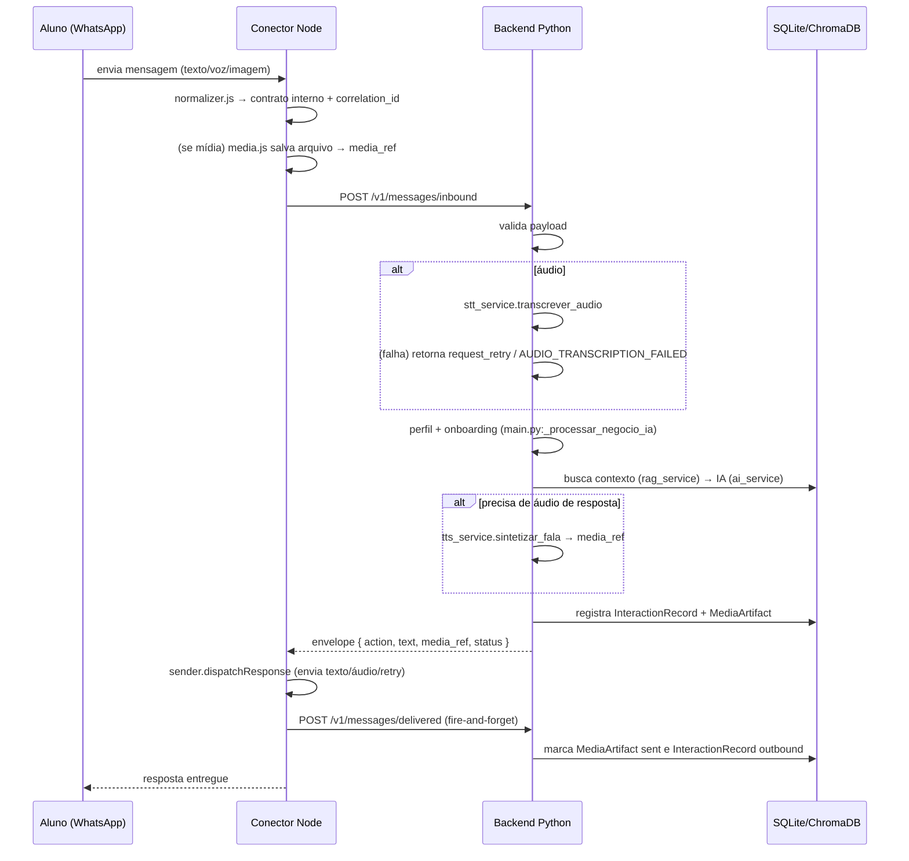
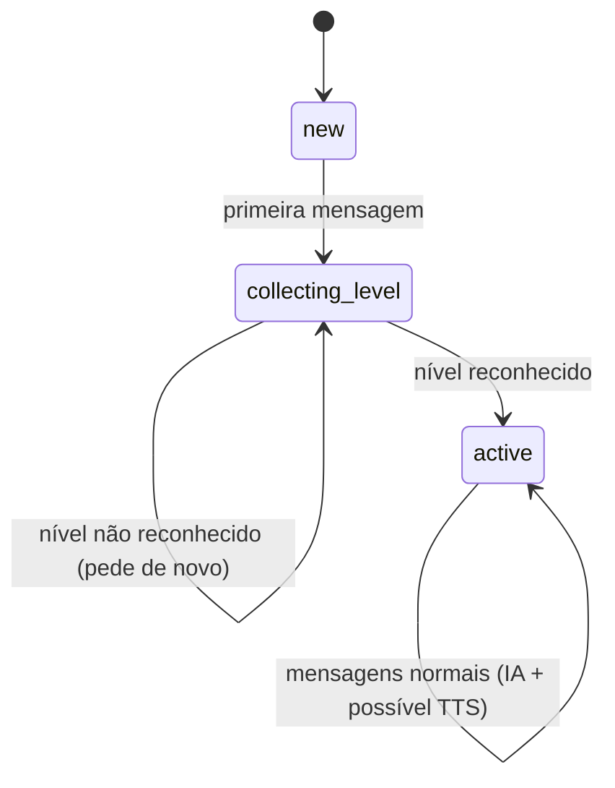

# 03 — Fluxos

## Visão geral do pipeline (Node → Python → Node)



## Fluxo de onboarding (primeira conversa)

1. Aluno manda a primeira mensagem. O Python busca (ou cria) o `LearnerProfile` com
   `onboarding_state = 'new'`.
2. `_processar_negocio_ia` responde a saudação da Curumim e pergunta o nível,
   mudando o estado para `collecting_level`.
3. O aluno escolhe um nível; `_interpretar_nivel` normaliza o texto (remove acentos,
   aceita "intermediario/avancado/medio", "basico", "iniciante/iniciando/novo") e
   grava `pedagogical_level` + `onboarding_state = 'active'`.
4. Enquanto `em_onboarding`, **não** chama a IA e **não** gera áudio TTS.



## Fluxo de mensagem de texto

1. `normalizer.js` → `message_type: "text"`, `text` preenchido.
2. Sem mídia → `postInbound` direto.
3. Python: perfil/onboarding → IA (`gerar_resposta_ia`) com contexto RAG.
4. Regra de áudio (`deve_incluir_audio`):
   - `iniciante` → sempre gera áudio (reforço);
   - `basico` → áudio **apenas se o aluno mandou áudio**;
   - `intermediario` → somente texto.
5. Se gera áudio: `action: "send_audio"` + `media_ref`; senão `action: "send_text"`.

## Fluxo de mensagem de voz

1. `normalizer.js` → `message_type: "audio"`, `needsMedia: true`.
2. `handlers.js` baixa e salva a mídia (`media.js`), anexando `media_ref`.
3. Python tenta `transcrever_audio(media_ref)`:
   - **Sucesso** → segue o fluxo normal com o texto transcrito.
   - **Falha** → retorna `action: "request_retry"` com
     `error_code: "AUDIO_TRANSCRIPTION_FAILED"` e a mensagem gentil de novo envio.
4. Arquivo inexistente → `MEDIA_FILE_NOT_FOUND`, também `request_retry`.

## Fluxo de imagem (mídia não suportada)

1. `normalizer.js` → `message_type: "image"` (image/video/document/sticker),
   `needsMedia: true` → a mídia é salva e o `media_ref` vai junto.
2. Python responde `send_text` com recusa amigável: *"Poxa, eu não consigo ver sua
   imagem, consegue digitar ou mandar um áudio do que quer dizer?"*.
3. Interação registrada no banco (`_salvar_interacao_banco`).

## Fluxo de fallback (falha no pipeline)

Qualquer erro no pipeline do Node (backend fora após retries, mídia sem download,
erro de envio) é tratado em `handlers.js`:

1. Loga o erro com `correlation_id`.
2. Envia ao aluno o texto `FALLBACK_TEXT`:
   *"Tive um probleminha para processar sua mensagem. Pode tentar de novo?"*
3. Confirma `postDelivered` com `status: "failed"` (fire-and-forget).
4. O processo **não** cai; apenas aquela mensagem falha.

## Fluxo de ack de entrega

Após `dispatchResponse`, o Node chama `confirmDelivery`:

| Situação | Payload |
|---|---|
| Sucesso | `status: "delivered"`, `action` real, `media_ref` se houver |
| Falha no pipeline | `status: "failed"`, `error` com a mensagem da exceção |

O Python (`handle_message_delivered`) então:

- localiza o perfil pelo `correlation_id` (via `InteractionRecord`) ou `phone_number`;
- grava um `InteractionRecord` **outbound** com status `sent`/`failed`;
- se `action == "send_audio"`, marca o `MediaArtifact` correspondente como `sent`/`failed`;
- é **idempotente**: payloads válidos sempre retornam `200 {"status": "ok"}`.

## Ciclo de vida da sessão WhatsApp

1. **Startup** (`index.js` → `main`): `checkHealth()` (aviso se backend fora),
   `limparMediaAntiga()`, `buildClient()`, `client.initialize()`.
2. **Primeira execução**: QR code no terminal → scan no WhatsApp Web. Sessão
   persistida via `LocalAuth` em `WHATSAPP_SESSION_DIR` (não pede QR de novo).
3. **Desconexão**: evento `disconnected` → `scheduleRestart` com backoff exponencial
   (base 5s, dobra a cada tentativa, teto 60s, máx. 10 tentativas).
4. **Esgotou tentativas**: log `fatal` + `process.exit(1)` (permite recuperação por
   orquestrador).
5. **Shutdown**: `SIGINT`/`SIGTERM` → cancela reconexão pendente, destrói a sessão,
   `process.exit(0)`.

## Rastreio ponta a ponta (exemplo de logs)

```text
Node (pino)   : { correlation_id: "abc...", message_id: "ABC123", msg: "Mensagem recebida do WhatsApp" }
Node (pino)   : { correlation_id: "abc...", action: "send_text", status: "ok", msg: "Resposta do backend Python recebida" }
Python (loguru): [Inbound] MsgID: ABC123 | Correlação: abc... | De: 5591999999999 | Tipo: text
Python (loguru): [Delivered] Correlação: abc... | Status: delivered | Action: send_text
```

O `correlation_id` permite reconstruir a interação inteira cruzando Node + Python +
banco (`InteractionRecord`).

## Próximos documentos

- [04-contrato-api.md](04-contrato-api.md) — a especificação exata dos payloads.
- [05-banco-de-dados.md](05-banco-de-dados.md) — como cada etapa é persistida.
