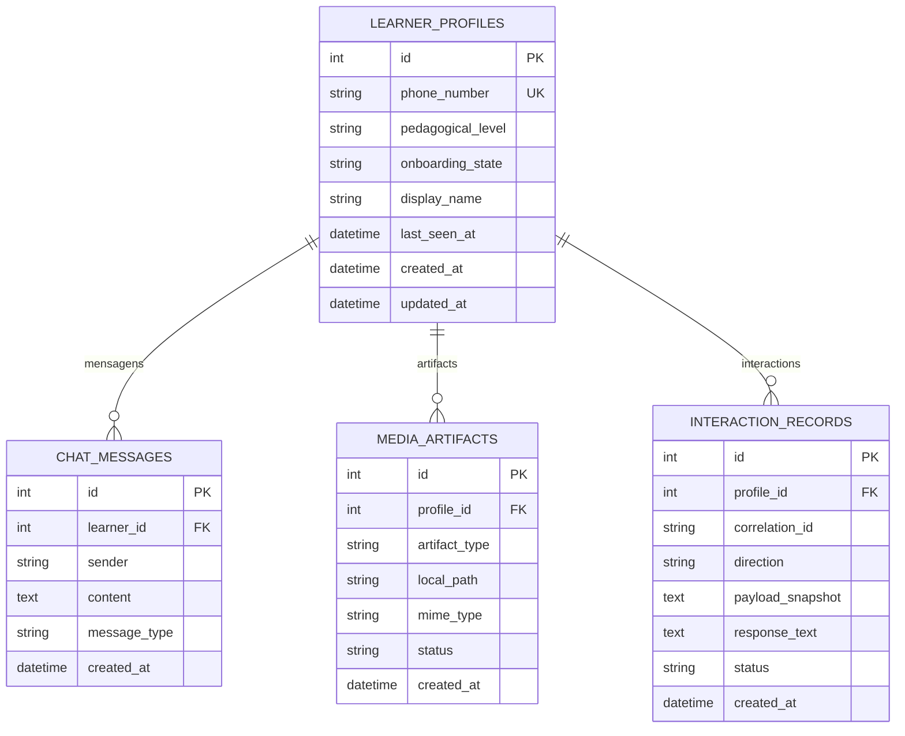
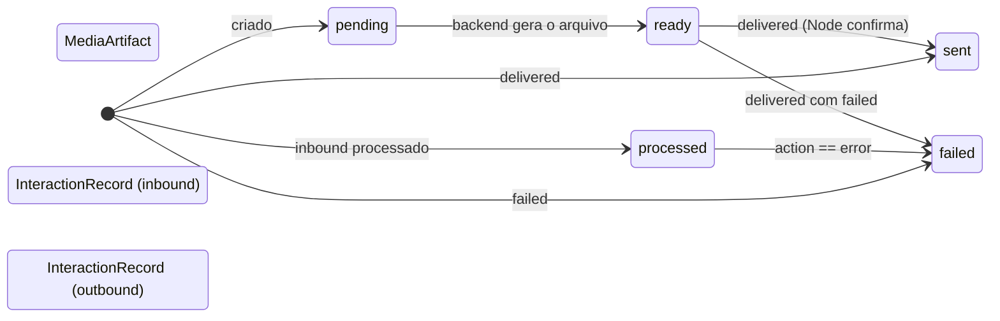

# 05 — Banco de Dados

O banco relacional é **SQLite** via **SQLAlchemy** (`src/curumim/models/database.py`).

## Localização do banco

```python
PROJECT_ROOT = Path(__file__).resolve().parents[2]   # → src/
DB_DIR = PROJECT_ROOT / "data"                        # → src/data/
DB_PATH = DB_DIR / "curumim.db"                       # → src/data/curumim.db
```

> **Atenção**: o arquivo real fica em `src/data/curumim.db` (não `data/curumim.db`
> na raiz). Não existe um `data/curumim.db` versionado — o banco é ignorado pelo
> `.gitignore` (`*.db`).

Engine e sessão são criados no import do módulo:

```python
engine = create_engine(DATABASE_URL, connect_args={"check_same_thread": False})
SessionLocal = sessionmaker(autocommit=False, autoflush=False, bind=engine)
```

## Tabelas



### `learner_profiles`

Perfil do aluno, identificado pelo número do WhatsApp.

| Coluna | Tipo | Notas |
|---|---|---|
| `id` | int PK | |
| `phone_number` | string | **unique**, indexed |
| `pedagogical_level` | string | `new`, `iniciante`, `basico`, `intermediario` (default `iniciante`) |
| `onboarding_state` | string | `new`, `collecting_level`, `active` (default `new`) |
| `display_name` | string | opcional |
| `last_seen_at` | datetime | atualizado a cada inbound |
| `created_at` / `updated_at` | datetime | timestamps UTC |

### `chat_messages`

Histórico textual da conversa (não é usado pelo Node; serve de contexto/auditoria).

| Coluna | Tipo | Notas |
|---|---|---|
| `id` | int PK | |
| `learner_id` | int FK | → `learner_profiles.id` |
| `sender` | string | `user` (aluno) ou `assistant` (Curumim) |
| `content` | text | |
| `message_type` | string | `text`, `audio`, `image` |
| `created_at` | datetime | indexed |

### `media_artifacts`

Rastreia os áudios **gerados** pelo backend (TTS) para envio pelo Node.

| Coluna | Tipo | Notas |
|---|---|---|
| `id` | int PK | |
| `profile_id` | int FK | → `learner_profiles.id` |
| `artifact_type` | string | `audio` |
| `local_path` | string | caminho em `data/audios/tts_*.ogg` |
| `mime_type` | string | `audio/ogg` |
| `status` | string | `pending` → `ready` → `sent` / `failed` |
| `created_at` | datetime | |

### `interaction_records`

**Rastreio ponta a ponta**: uma linha por mensagem processada e por confirmação de
entrega, ligada ao `correlation_id`.

| Coluna | Tipo | Notas |
|---|---|---|
| `id` | int PK | |
| `profile_id` | int FK | → `learner_profiles.id` |
| `correlation_id` | string | indexed; o mesmo valor gerado no Node |
| `direction` | string | `inbound` (mensagem recebida) ou `outbound` (ack de entrega) |
| `payload_snapshot` | text | JSON do payload original |
| `response_text` | text | resposta gerada / erro |
| `status` | string | `received`, `processed`, `sent`, `failed` |
| `created_at` | datetime | indexed |

## Estados e transições



## Onde cada tabela é gravada

| Ponto | Tabela | Função |
|---|---|---|
| Primeira mensagem / onboarding | `learner_profiles`, `chat_messages` | `_processar_negocio_ia` |
| Imagem não suportada | `learner_profiles`, `chat_messages` | `_salvar_interacao_banco` |
| Mensagem processada | `interaction_records` (inbound, `processed`) | `_registrar_interacao` |
| Áudio TTS gerado | `media_artifacts` (ready) | `_registrar_artefato_audio` |
| Ack de entrega | `interaction_records` (outbound, `sent`/`failed`) + `media_artifacts` (`sent`/`failed`) | `handle_message_delivered` |

## Migração idempotente

`inicializar_banco()` roda no `create_app()`:

1. `Base.metadata.create_all(engine)` — cria tabelas que não existem;
2. `_adicionar_coluna_se_faltar(engine, 'learner_profiles', 'display_name', 'VARCHAR')`;
3. `_adicionar_coluna_se_faltar(engine, 'learner_profiles', 'last_seen_at', 'DATETIME')`.

`_adicionar_coluna_se_faltar` usa `inspect(engine).get_columns()` e só executa o
`ALTER TABLE` se a coluna não existir — seguro para reexecução e para bancos já
criados em produção.

## Próximos documentos

- [04-contrato-api.md](04-contrato-api.md) — o contrato que alimenta essas tabelas.
- [07-modulos-python.md](07-modulos-python.md) — como `main.py` usa `SessionLocal`.
