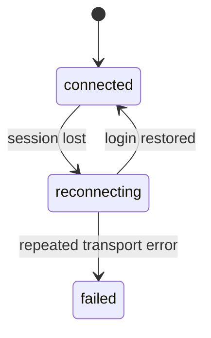
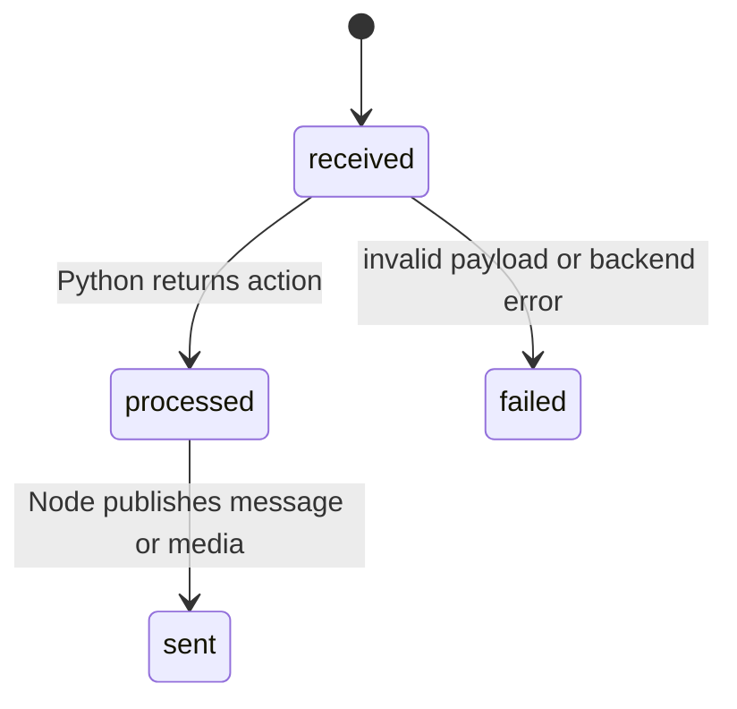

# Data Model: WhatsApp JS + Python Split

## Entities

### LearnerProfile
Represents a student identity linked to a WhatsApp sender number.

**Fields**
- `id`: internal identifier
- `phone_number`: unique WhatsApp number
- `pedagogical_level`: `new`, `iniciante`, `basico`, `intermediario`
- `onboarding_state`: `new`, `collecting_level`, `active`
- `display_name`: optional human readable name
- `created_at`: creation timestamp
- `updated_at`: last modification timestamp
- `last_seen_at`: last inbound interaction timestamp

### InboundMessage
Represents a message received by the Node transport and forwarded to Python.

**Fields**
- `message_id`: transport message identifier
- `phone_number`: sender number
- `message_type`: `text`, `audio`, `interactive`, `system`
- `text`: normalized text when available
- `media_ref`: local path, temporary URL, or storage key when the message includes media
- `received_at`: timestamp
- `correlation_id`: shared trace id between Node and Python

### ProcessingResult
Represents the instruction returned by Python to the Node transport.

**Fields**
- `correlation_id`: shared trace id
- `action`: `send_text`, `send_audio`, `request_retry`, `noop`
- `text`: final text to send when applicable
- `media_ref`: artifact reference for audio replies
- `media_type`: `audio`
- `status`: `ok`, `retry`, `error`
- `error_code`: optional failure classification

### MediaArtifact
Represents a generated audio file prepared by Python for delivery by Node.

**Fields**
- `id`: internal identifier
- `profile_id`: foreign key to `LearnerProfile`
- `artifact_type`: `audio`
- `local_path`: file path or shared storage key
- `mime_type`: content type
- `status`: `pending`, `ready`, `sent`, `failed`
- `created_at`: timestamp

### InteractionRecord
Represents the full conversational history needed for traceability.

**Fields**
- `id`: internal identifier
- `profile_id`: foreign key to `LearnerProfile`
- `direction`: `inbound` or `outbound`
- `payload_snapshot`: normalized inbound or outbound payload
- `response_text`: reply generated by Python when applicable
- `status`: `received`, `processed`, `sent`, `failed`
- `created_at`: timestamp

## State Transitions

### Session relay

### Message processing
